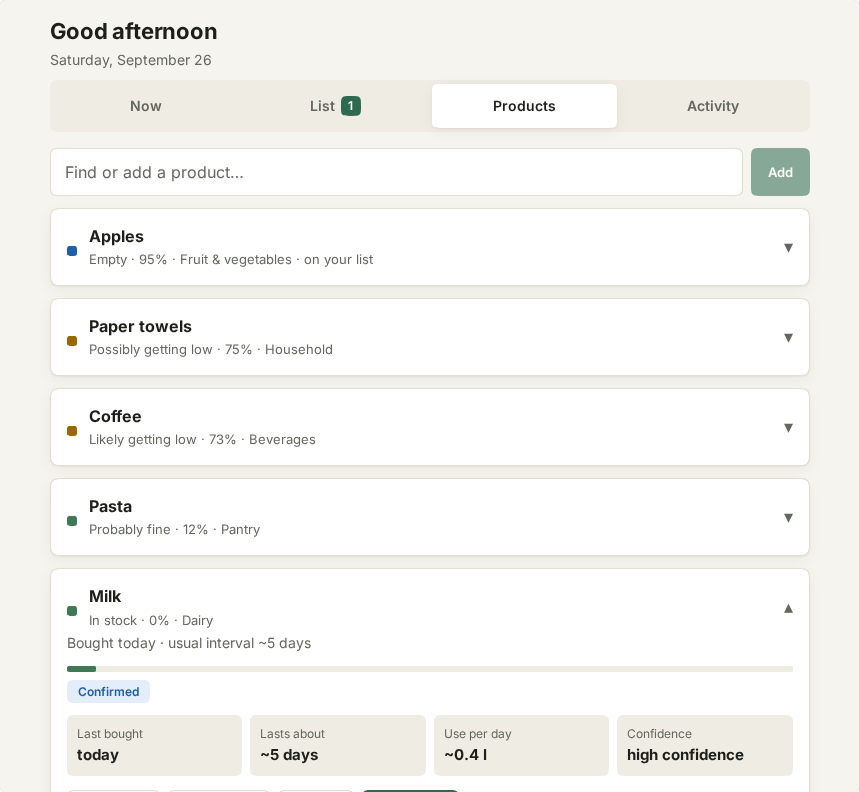

# Three-minute demo

There is no hosted demo. Everything below runs on your own machine against a local
Twenty server (Docker). The first container start takes a few minutes; the demo
itself takes about three.

## 1. Start the app

```bash
git clone https://github.com/micha16372/everyday-runtime.git
cd everyday-runtime
corepack enable && yarn install
yarn twenty docker:start
yarn twenty apply
```

Open <http://localhost:2020>, sign in with `tim@apple.dev` / `tim@apple.dev`
(Twenty's local development account) and choose **Everyday Runtime** in the sidebar.
If `apply` fails with `ECONNRESET`, the server is still warming up — run it again
after a minute.

## 2. Load the demo household

Press **Load demo household**. Five products appear with a made-up but realistic
history, dated relative to today:

| Product | What it shows |
| --- | --- |
| Milk | a very regular rhythm: bought every 5 days, last time 6 days ago |
| Coffee | a regular rhythm plus a “used some” report since the last purchase |
| Paper towels | only two purchases, so the estimate is only “possible” |
| Pasta | seen in stock yesterday, so not needed despite its age |
| Apples | marked empty yesterday — confirmed, already on the list |

## 3. Understand the Milk suggestion


Milk shows **Probably low · 89%** with the reason *“Last purchased 6 days ago · usual
interval ~5 days”*. The striped bar and the **Estimate** chip mean: this is
inferred, nobody reported it. Apples, in contrast, are **Confirmed** — someone
marked them empty.

## 4. Open “Why?”


Tap **Why?** on Milk. You see every factor the engine used: number of purchases,
how regular they were, when it was expected to run out, and how confident it is.
The same numbers always give the same answer — there is no AI service involved.

## 5. Buy it

Tap **Add to list** on Milk, open **List**, tap the check mark next to Milk,
adjust the quantity if you like (price and store are optional) and press
**Bought 2 l**.

## 6. See the new estimate



Open **Products → Milk**: it is now **In stock · Confirmed**, *“Bought today · usual
interval ~5 days”*, with the expected duration and the typical use per day. The
purchase also appears under **Activity**.

Things to try next:

- **Still have it** on Coffee — the suggestion disappears and the estimate moves
  back.
- Buy a larger quantity than usual — the app expects it to last longer
  (“3 l usually lasts ~2 weeks”).
- Mark something **empty** earlier than expected a couple of times — the app
  learns that it runs out sooner and says so in “Why?”.

If a suggestion ever feels wrong, please tell us with the
[“Suggestion felt wrong”](https://github.com/micha16372/everyday-runtime/issues/new?template=suggestion_feedback.yml)
issue template.
