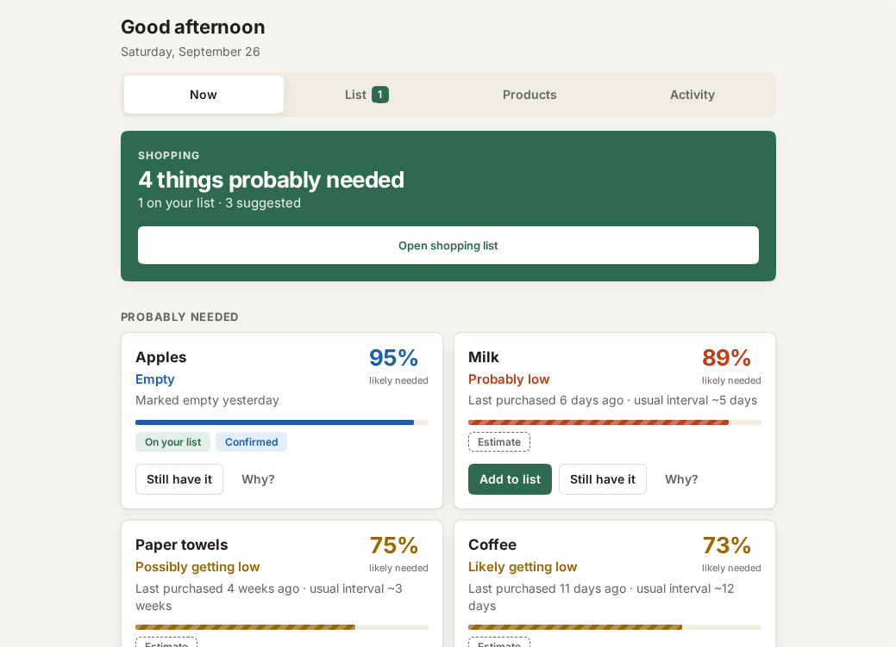
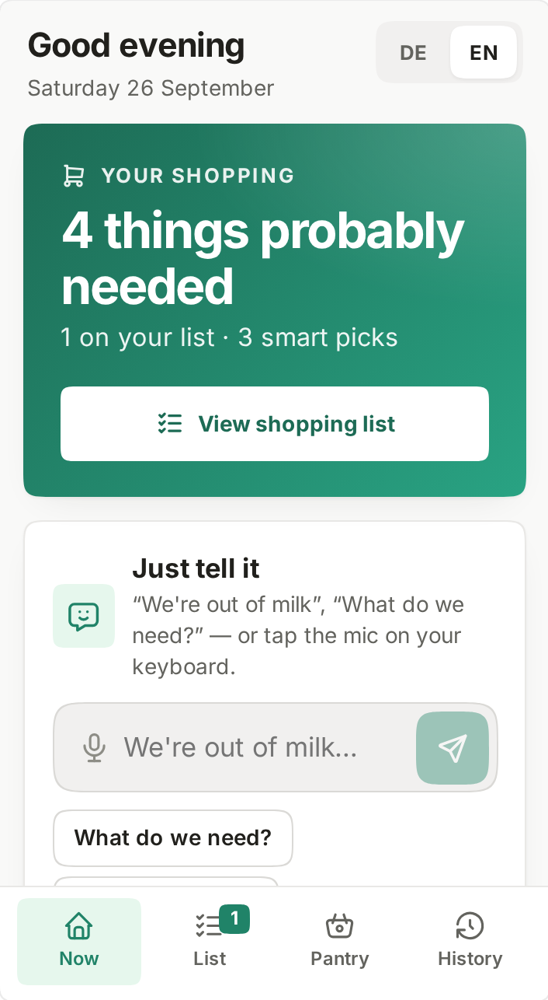
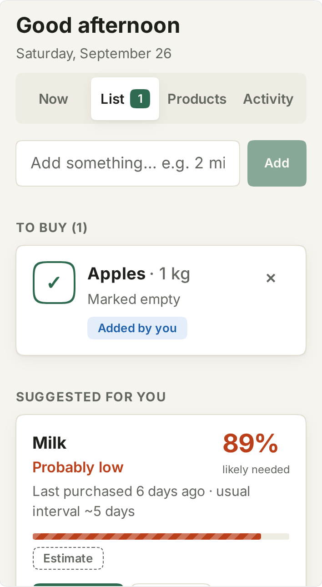
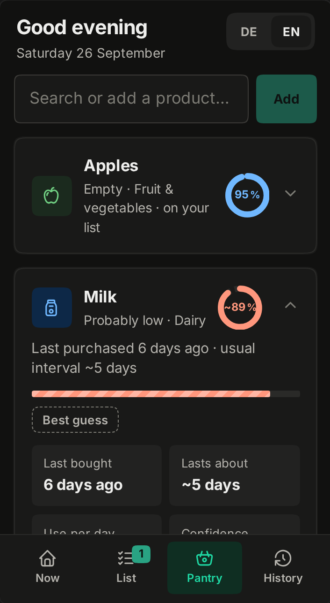
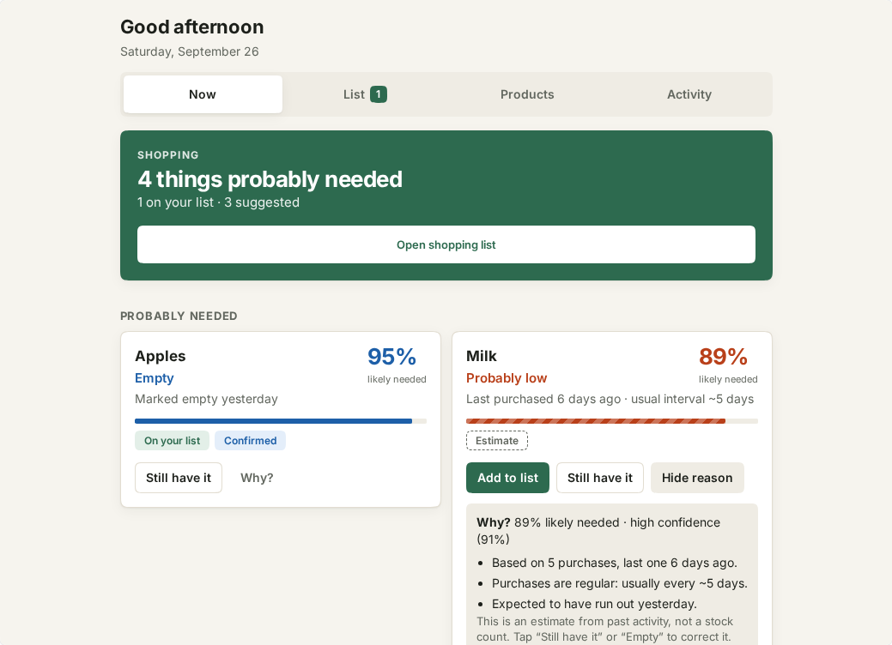

# Everyday Runtime

**An open-source, self-hosted shopping assistant that learns what a household probably needs — without requiring perfect inventory tracking.**

[](https://github.com/micha16372/everyday-runtime/actions/workflows/ci.yml)

<p align="center">
  
</p>

> **Milk — probably low · 89%**
> Last purchased 6 days ago · usual interval ~5 days

Everyday Runtime is built as a [Twenty](https://twenty.com) app. It runs on your own
Twenty server, keeps your data there, and needs no AI service, no cloud account and
no API key to work.

## The problem

Shopping lists fail in two ways:

- **Plain lists** only know what someone remembered to write down. Everyone else in
  the household finds out that the milk is gone when the fridge is open.
- **Inventory apps** promise to know what is in the house — if you scan every item
  in and every item out. Nobody does that for long, and a stock count that is wrong
  is worse than none.

Real households have *partial* information: a receipt here, “we're out of coffee”
there, a glance into the pantry. Everyday Runtime is designed for exactly that.

## How it is different

| | Plain shopping list | Inventory tracker | Everyday Runtime |
| --- | --- | --- | --- |
| What you record | Items to buy | Every item in and out | Whatever you happen to know |
| What it knows | Only what's written | An exact count (in theory) | A **probability** with a **reason** |
| When data is missing | Silent | Wrong | Says it is unsure |
| Suggests items | No | Rarely | Yes, and explains why |

The core idea is a small, explicit pipeline:

```
Product → Observation → Estimated state → Confidence → Need → Shopping action → Purchase / outcome
```

It never pretends to know a stock level. It says *“Milk is probably low — 89%”*,
shows the evidence, and lets you correct it with one tap (“Still have it”, “Empty”).
Direct reports are shown as **Confirmed**; everything inferred is visibly an
**Estimate**.

## Features (v0.1)

- **Now** — a calm overview of what is probably needed, with percentage, a plain
  headline (“Probably low”, “Possibly getting low”) and a one-line reason.
- **Why?** on every suggestion — the full explanation: number of purchases,
  regularity, expected run-out, conflicting reports, stale data.
- **Shopping list** — quick add (`2 milk`, `coffee x3`), items added by you vs.
  suggested items (with the confidence at the time), mark as bought with quantity,
  optional price and store, “Not now” for suggestions.
- **Products** — search, create, and per-product details: last bought, usual
  interval, confidence, recent evidence; actions *It’s empty*, *Still have it*,
  *Bought*, *Add to list*, *Archive*.
- **Activity** — every observation, grouped by day. This is exactly the evidence the
  engine uses.
- **Demo household** — five products (Milk, Coffee, Paper towels, Pasta, Apples)
  that show every rule of the engine within a minute.
- **`GET /s/needs`** — an authenticated JSON endpoint with the same results, for
  dashboards and future integrations.
- Mobile-friendly layout, light and dark mode, real buttons with labels and large tap targets (see the known accessibility limitation in [CHANGELOG.md](CHANGELOG.md)).

## Screenshots

| Now (phone) | Shopping list (phone) | Product details (dark) |
| --- | --- | --- |
|  |  |  |

<p align="center">
  
</p>

## How it works

```
src/
  domain/        Pure TypeScript: inference engine, list logic, texts, demo data (no Twenty, no React)
  data/          Twenty REST repository + named user actions (the only code that writes)
  ui/            React screens rendered by one Twenty front component
  objects/       Product, Observation, ShoppingItem, Purchase
  logic-functions/  GET /s/needs and the health check
```

The inference engine (`src/domain/inference.ts`) is deterministic and has no
hidden state: the same observations at the same moment always give the same
result. In short:

| Evidence | Effect |
| --- | --- |
| Marked **empty** / **added as needed** | Confirmed, very high need (95% / 90%) |
| **Bought** in the last 2 days | Confirmed in stock, need ≤ 5% |
| **Seen in stock** in the last day | Confirmed in stock, need ≤ 10% |
| Regular purchases | Need rises around the usual interval (median of recent intervals) |
| Purchase quantities | 3 l last longer than 1 l — based on your typical use per day |
| Earlier “Empty” / “Still have it” reports | The expected duration is adjusted (bounded, explained) |
| Irregular purchases / only one purchase | Same idea, lower confidence → “possible” |
| “Used some” since the last purchase | Expected run-out moves earlier |
| “Empty” then “still have it” within a day | Conflict → “Unclear — please check” |
| Old evidence | Confidence and need drift back towards “don’t know” |
| No data | Unknown — never suggested |

Details, formulas and the reasoning behind them: [docs/ARCHITECTURE.md](docs/ARCHITECTURE.md)
and [docs/PRODUCT_PRINCIPLES.md](docs/PRODUCT_PRINCIPLES.md).

## Quick start

Requirements: Node.js 24 (see `.nvmrc`), Yarn 4 (via Corepack), Docker.

```bash
git clone https://github.com/micha16372/everyday-runtime.git
cd everyday-runtime
corepack enable
yarn install
yarn twenty docker:start   # local Twenty server on http://localhost:2020
yarn twenty apply          # build, register and install the app
```

Open <http://localhost:2020>, sign in with the development account
`tim@apple.dev` / `tim@apple.dev`, choose **Everyday Runtime** in the sidebar and
press **Load demo household**.

New here? [DEMO.md](DEMO.md) walks through the whole workflow in three minutes.

The first start of the Twenty container takes a few minutes. If `yarn twenty apply`
fails with `ECONNRESET` right after `docker:start`, the server is still warming up —
wait a minute and run it again. More in [SETUP.md](SETUP.md).

## Local development

```bash
yarn twenty dev          # watch mode: rebuilds and syncs on every change
yarn lint                # oxlint
yarn typecheck           # TypeScript (tsgo)
yarn test                # unit tests: engine, list logic, repository, actions
yarn test:integration    # end-to-end workflow against a running Twenty server
```

`yarn test:integration` installs the app into the server it runs against and
uninstalls it afterwards; run `yarn twenty apply` again if you want to keep using
the app locally.

## Self-hosting and privacy

- All data lives in **your** Twenty workspace database. Everyday Runtime has no
  backend of its own and sends nothing anywhere else.
- No AI provider, no telemetry, no external API calls. The engine is plain
  arithmetic you can read and test.
- Access follows Twenty's permissions: the UI and the `/s/needs` route act as the
  signed-in person.

See [docs/PRIVACY.md](docs/PRIVACY.md) for what is stored and how to delete it.

## Roadmap

- **v0.2** — better consumption intervals, households with several people, richer activity history
- **v0.3** — barcodes, receipt import, import/export
- **v0.4** — webhooks, Home Assistant, Telegram capture
- **v0.5** — stores, offers, price observations, price per unit, offer rating, smart stock-up purchases
- **v1.0** — a stable self-hosted shopping workflow, upgrade docs, a documented privacy model, feedback from real households

Full list: [ROADMAP.md](ROADMAP.md).

## Contributing

Contributions are welcome — especially real-world feedback on suggestions that
felt wrong. Start with [CONTRIBUTING.md](CONTRIBUTING.md) and the issues labelled
[`good first issue`](https://github.com/micha16372/everyday-runtime/labels/good%20first%20issue).

- Questions and ideas: [Discussions](https://github.com/micha16372/everyday-runtime/discussions) · help: [SUPPORT.md](SUPPORT.md)
- Security issues: [SECURITY.md](SECURITY.md) (private reporting only)
- Community rules: [CODE_OF_CONDUCT.md](CODE_OF_CONDUCT.md) · maintainers: [MAINTAINERS.md](MAINTAINERS.md)
- Releases: [GitHub releases](https://github.com/micha16372/everyday-runtime/releases) · notable changes: [CHANGELOG.md](CHANGELOG.md)

## License

[MIT](LICENSE)
